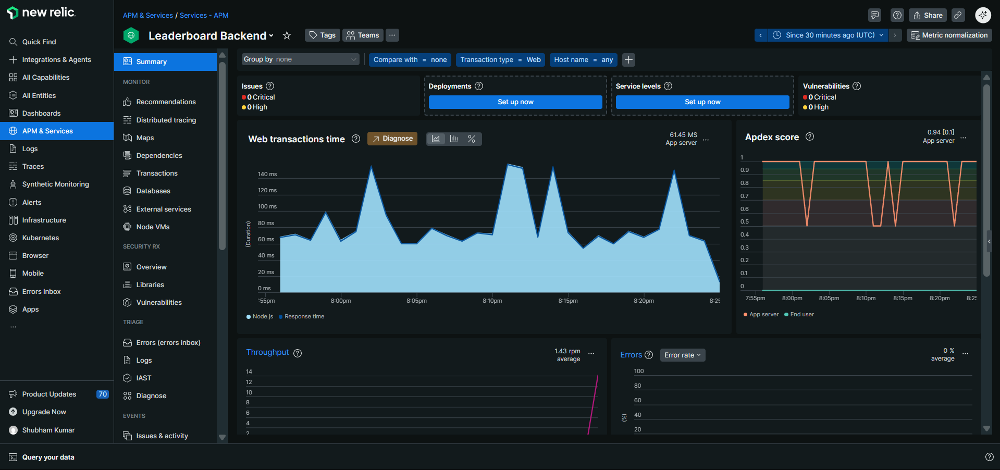
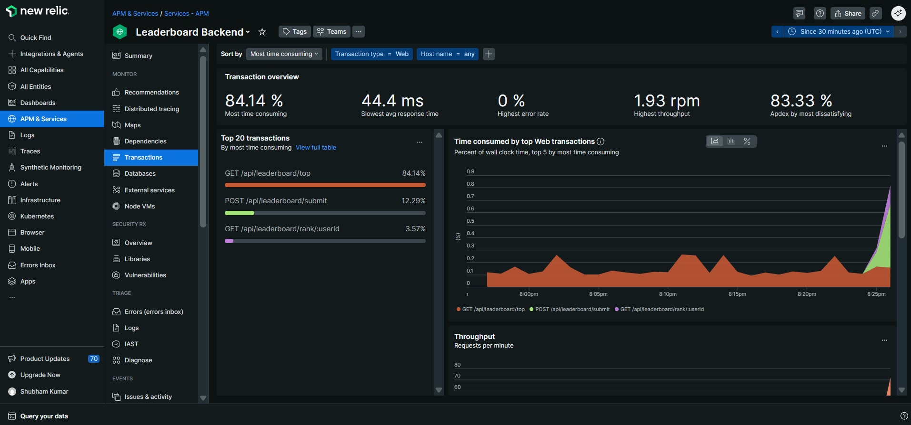
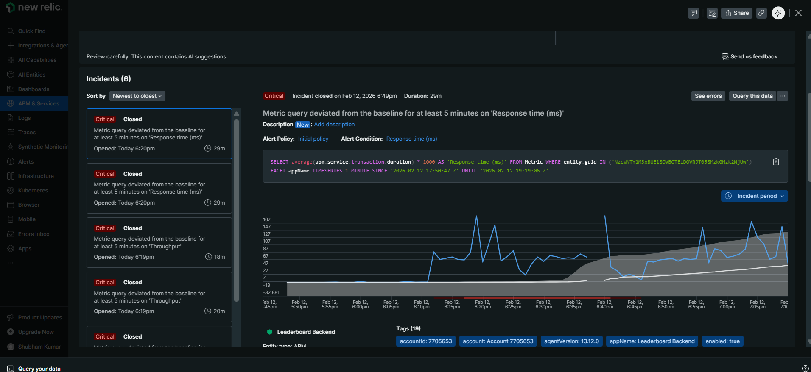

# Gaming Leaderboard

A leaderboard system for tracking player scores: submit scores, view top 10, and check a player's rank. Built with Express (backend), Next.js (frontend), PostgreSQL, Redis, and New Relic for monitoring.

## Demo & Screenshots

**Demo video:** Host the demo locally (e.g. `gaming-leaderboard-demo.mp4`) or upload to YouTube / Google Drive and add the link here. The repo does not include the video (GitHub file size limit). Suggested: upload as unlisted, then paste the link below.

**New Relic (under load):**

| Overview | Transactions / Latency | Database & Bottlenecks |
|----------|-------------------------|-------------------------|
|  |  |  |

More details and captions: [docs/PERFORMANCE_NEWRELIC.md](docs/PERFORMANCE_NEWRELIC.md).

## Prerequisites

- **Node.js** (v18+)
- **PostgreSQL** (e.g. 14+)
- **Redis** (e.g. 6+)
- **Python 3** (for load test script; `requests` required)

## Environment

### Backend

Create `backend/.env` (or set in shell):

```env
DB_PASSWORD=your_postgres_password
```

Optional for New Relic (recommended; see [docs/NEWRELIC_SETUP.md](docs/NEWRELIC_SETUP.md) for full setup):

```env
NEW_RELIC_LICENSE_KEY=your_40_char_license_key
NEW_RELIC_APP_NAME=Leaderboard Backend
```

Backend expects:

- PostgreSQL: `localhost:5432`, database `leaderboard`, user `postgres`, password from `DB_PASSWORD`.
- Redis: `127.0.0.1:6379`.

## Database Setup

1. Create the database:

```bash
createdb -U postgres leaderboard
```

2. Create tables (run from project root):

```bash
psql -U postgres -d leaderboard -f scripts/schema.sql
```

3. Seed data (choose one):

**Full dataset (1M users, 5M game_sessions)** — can take a long time:

```bash
psql -U postgres -d leaderboard -f scripts/seed.sql
```

**Small dataset (10k users, 50k sessions)** — for quick local testing:

```bash
psql -U postgres -d leaderboard -f scripts/seed-small.sql
```

4. Add indexes for better API latency:

```bash
psql -U postgres -d leaderboard -f scripts/indexes.sql
```

## Running the App

### Backend (port 8000)

```bash
cd backend
npm install
npm run dev
```

### Frontend (port 3000)

```bash
cd client
npm install
npm run dev
```

Open [http://localhost:3000](http://localhost:3000) for the live leaderboard UI. The app talks to the backend at `http://localhost:8000` by default; set `NEXT_PUBLIC_API_URL` (e.g. in `client/.env.local`) to point to another API URL if needed.

### Load Test (simulate real usage)

With the backend running:

```bash
pip install requests
python load_test.py
```

This script repeatedly picks a random user ID, submits a score, fetches the top 10 and that user's rank, then sleeps 0.5–2 seconds. Set `MAX_USER_ID` in `load_test.py` to match your seed: **10000** for `seed-small.sql`, **1000000** for full `seed.sql`. Use it to generate load for New Relic and to verify performance.

### Tests (backend)

Ensure PostgreSQL and Redis are running and the database is seeded (e.g. `seed-small.sql` so user 1 exists). Then:

```bash
cd backend
npm install
npm test
```

Runs Jest tests for the three leaderboard APIs (GET /top, POST /submit, GET /rank/:userId). Use `npm run test:watch` for watch mode.

## API Endpoints

| Method | Endpoint | Description |
|--------|----------|-------------|
| POST | `/api/leaderboard/submit` | Submit a score. Body: `{ "user_id": number, "score": number }` |
| GET | `/api/leaderboard/top` | Top 10 players by total score |
| GET | `/api/leaderboard/rank/:userId` | Rank and total score for a user |
| POST | `/api/users` | Create user. Body: `{ "username": string }` |
| GET | `/health` | Health check |

## Project Structure

- **backend/** — Express API (TypeScript), PostgreSQL, Redis cache, New Relic
- **client/** — Next.js app (React), live leaderboard + rank lookup
- **scripts/** — DB schema, seed (full + small), indexes
- **load_test.py** — Load simulation script
- **docs/** — [HLD](docs/HLD.md), [LLD](docs/LLD.md), [System Design Diagrams](docs/SYSTEM_DESIGN_DIAGRAMS.md), [Performance & New Relic screenshots](docs/PERFORMANCE_NEWRELIC.md)

## Performance & Monitoring

- **Caching:** GET `/api/leaderboard/top` is cached in Redis (10s TTL); cache is invalidated on score submit.
- **Indexes:** `leaderboard(total_score DESC)` and `game_sessions(user_id)` for fast queries.
- **Transactions:** Score submit updates `game_sessions` and `leaderboard` in a single transaction.
- **New Relic:** Configured in `backend/newrelic.js`. Run under load and use the New Relic dashboard for latency, bottlenecks, and alerts. **Screenshots:** see [docs/PERFORMANCE_NEWRELIC.md](docs/PERFORMANCE_NEWRELIC.md) (uses images in `newrelic/`).
