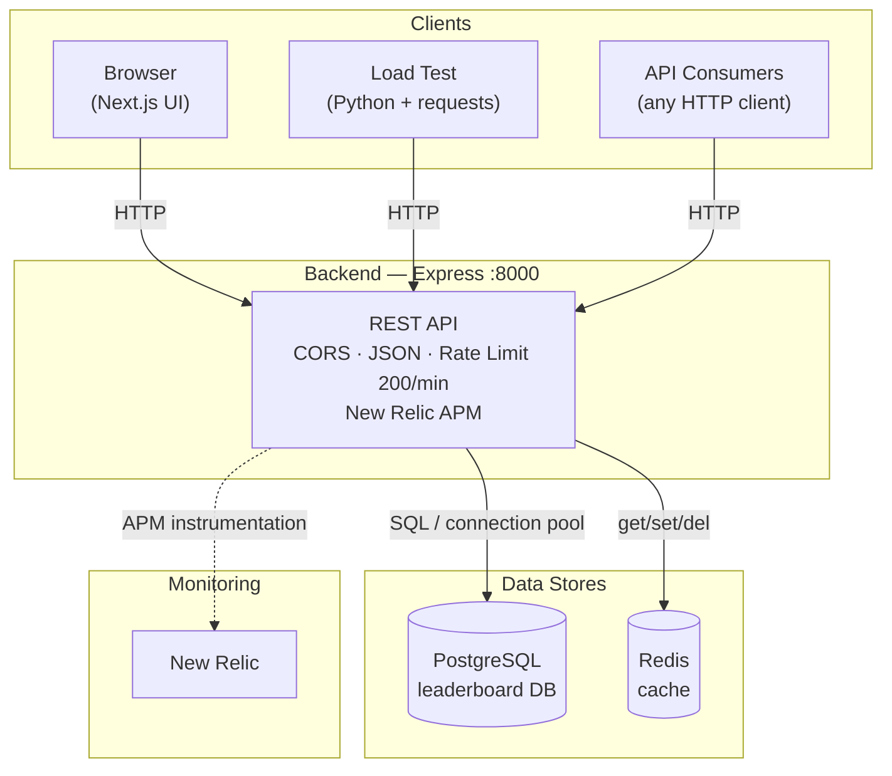
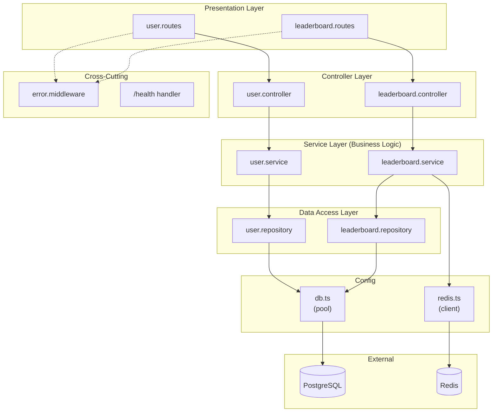
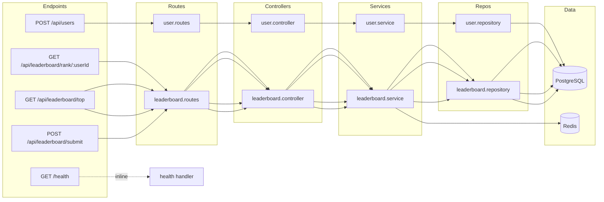
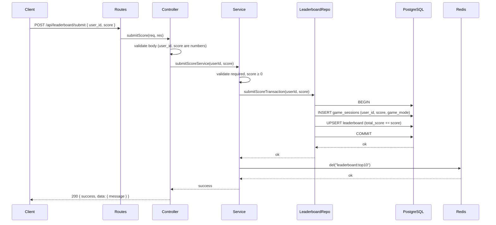
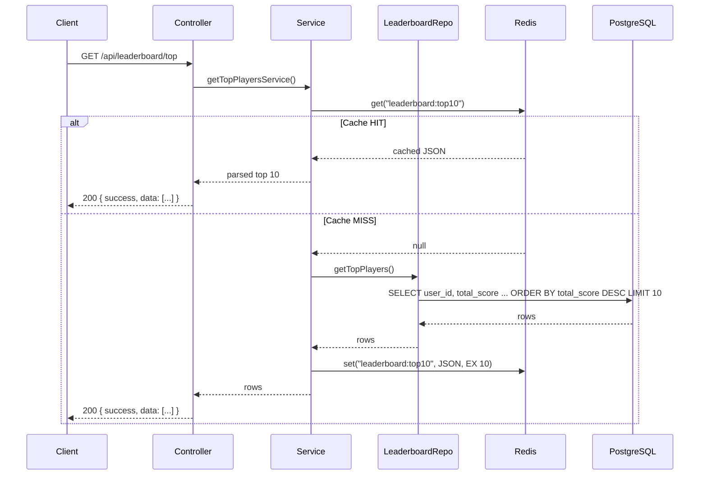
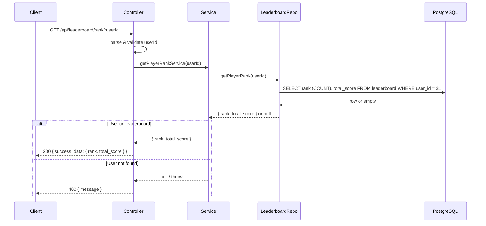
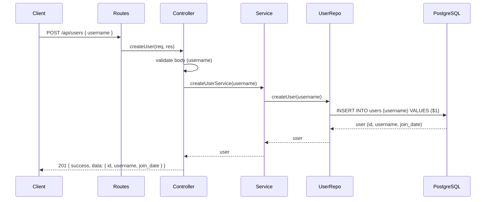
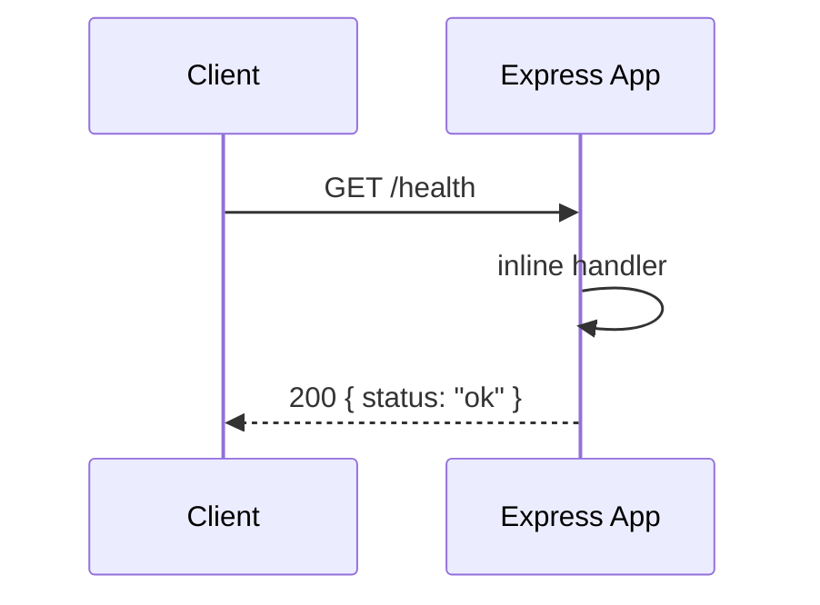
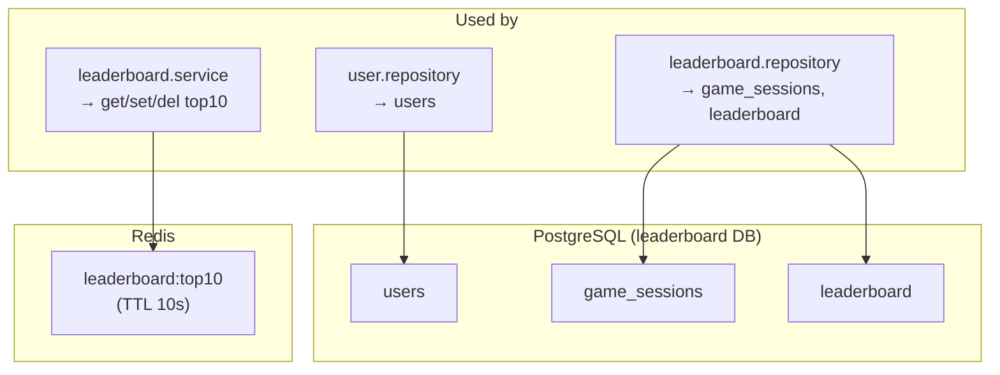
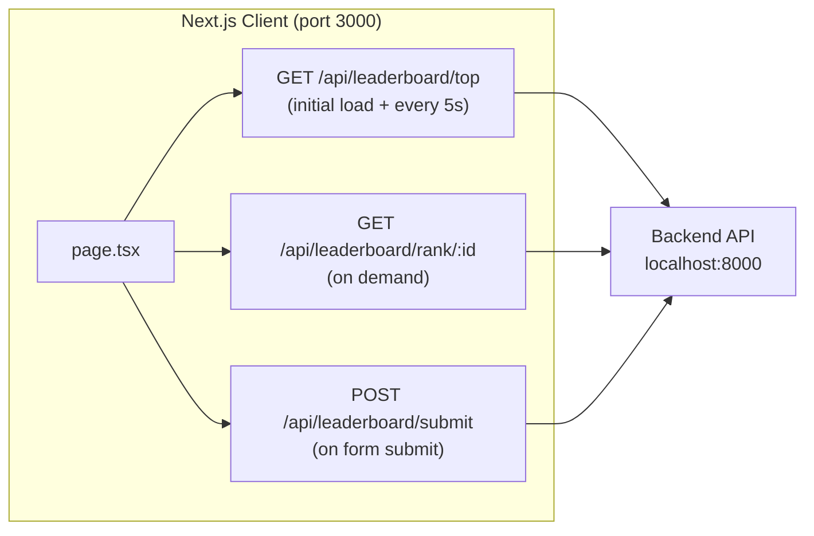

# System Design Diagrams — Gaming Leaderboard

This document contains system design diagrams showing **what uses what** and **all flows** for the Gaming Leaderboard project. The diagrams match the actual codebase (routes, controllers, services, repositories in `backend/src/`). They are in [Mermaid](https://mermaid.js.org/) format and render in GitHub, VS Code, and many doc viewers.

**Quick navigation:**  
[1. System Context](#1-system-context-what-uses-what) · [2. Backend Components](#2-backend-component-diagram-what-uses-what-inside-backend) · [3. API → Layers](#3-api-endpoints-and-their-layers) · [4. Submit Score](#4-flow-submit-score) · [5. Get Top 10](#5-flow-get-top-10-cache-through) · [6. Get Rank](#6-flow-get-player-rank) · [7. Create User](#7-flow-create-user) · [8. Health](#8-flow-health-check) · [9. Data Stores](#9-data-store-usage-overview) · [10. Frontend](#10-frontend--backend-flow-ui) · [11. Summary Table](#11-all-flows-summary-table)

---

## 1. System Context (What Uses What)

High-level view: who uses the system and what external systems the backend depends on.

**Summary:**
- **Clients** (Browser, Load Test, API consumers) call the **Backend** over HTTP.
- **Backend** uses **PostgreSQL** for persistence and **Redis** for caching; it reports to **New Relic** for monitoring.

---

## 2. Backend Component Diagram (What Uses What Inside Backend)

Layered architecture: routes → controllers → services → repositories; config and middleware are cross-cutting.

**Summary:**
- **Routes** map URLs to **controllers**; **controllers** call **services**; **services** use **repositories** and **Redis**.
- **Repositories** use **db** config (pool) to talk to **PostgreSQL**; **leaderboard.service** uses **redis** config for cache.
- **Error middleware** wraps all route handlers; **/health** is a simple inline handler.

---

## 3. API Endpoints and Their Layers

Which endpoint goes through which files and dependencies.

**Summary:**
- **Submit** and **rank** use leaderboard routes → controller → service → leaderboard repository → PostgreSQL.
- **Top 10** uses leaderboard service with **Redis** (cache) and, on cache miss, **leaderboard repository** → PostgreSQL.
- **Create user** uses user routes → user controller → user service → user repository → PostgreSQL.
- **Health** is a single handler, no service/repository.

---

## 4. Flow: Submit Score

End-to-end flow from client to DB and cache invalidation.

**Summary:**
- **Controller** validates that `user_id` and `score` are numbers; **service** validates they are present and `score ≥ 0`. Then the service runs a **single DB transaction** via `submitScoreTransaction`: insert `game_sessions`, upsert `leaderboard`.
- After commit, the service **invalidates** Redis key `leaderboard:top10` so the next top-10 read is fresh.

---

## 5. Flow: Get Top 10 (Cache-Through)

Cache hit vs cache miss path.

**Summary:**
- Service checks **Redis** first. **Hit:** return cached JSON. **Miss:** query DB via repository, **set** cache with 10s TTL, then return.

---

## 6. Flow: Get Player Rank

No cache; single DB query.

**Summary:**
- Rank is computed in the repository (e.g. `COUNT(*) WHERE total_score > user's score`). No Redis; response is returned directly.

---

## 7. Flow: Create User

Used to create users (e.g. before submitting scores).

**Summary:**
- User creation goes through user routes → controller → user service → user repository → PostgreSQL; response returns the new user.

---

## 8. Flow: Health Check

Simple liveness check; no DB or Redis in the diagram (implementation may add optional checks).

**Summary:**
- Health is a single route handler; no service or repository. Optional: bootstrap or health handler can ping DB/Redis for readiness.

---

## 9. Data Store Usage Overview

What each store is used for and which components use it.

**Summary:**
- **PostgreSQL:** `users` (user.repository), `game_sessions` and `leaderboard` (leaderboard.repository).
- **Redis:** Only key `leaderboard:top10`; read/written by leaderboard.service; invalidated on score submit.

---

## 10. Frontend → Backend Flow (UI)

How the Next.js client uses the API.

**Summary:**
- Single page (`client/app/page.tsx`) uses three API operations: **top** (loaded on mount and refreshed every 5s), **rank** (when user enters an ID and requests rank), **submit** (when user submits the score form). All use the same backend base URL (`NEXT_PUBLIC_API_URL` or `http://localhost:8000`).

---

## 11. All Flows Summary Table

| Flow            | Trigger              | Path / Method                    | Uses Redis | Uses PostgreSQL | Cache invalidation     |
|-----------------|----------------------|----------------------------------|------------|------------------|------------------------|
| Submit score    | Form / API           | POST /api/leaderboard/submit     | Invalidate | Yes (transaction)| del leaderboard:top10  |
| Get top 10      | Page load / refresh  | GET /api/leaderboard/top         | Yes (read/write) | On cache miss | —                      |
| Get rank        | User clicks “Get rank” | GET /api/leaderboard/rank/:id  | No         | Yes              | —                      |
| Create user     | API / setup          | POST /api/users                  | No         | Yes              | —                      |
| Health          | LB / monitoring      | GET /health                      | No         | No               | —                      |

---

*For system goals and NFRs see [HLD.md](HLD.md). For API contracts and schema see [LLD.md](LLD.md).*
